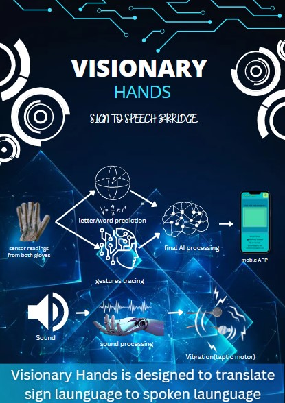

# Welcome to Dylan Vianen's Documentation

## Setup Dev Environment for ESP32 S2

First i downloaded the Arduino IDE from the [website](https://docs.arduino.cc/)


 And waited until the download was done and opened the file and went through the steps for the installation.


After that i open the IDE and opened the preferences


And added the link for [esp32 devices](https://docs.espressif.com/projects/arduino-esp32/en/latest/installing.html#installing-using-arduino-ide) on arduino IDE


After that i downloaded [spiffs for the ESP32-s2](https://github.com/me-no-dev/arduino-esp32fs-plugin)


And i unzipped it in the sketchbook location

And thats it!

### Build HTML5 Chat app

So the idea is to make a chat app that communicates with other users via MQTT

##### Introduction to HTML5

HTML (HyperText Markup Language) is the code that is used to structure a web page and its content.

##### Introduction to CSS

CSS stands for Cascading Style Sheets. CSS describes how HTML elements are to be displayed on screen, paper, or in other media. CSS saves a lot of work. It can control the layout of multiple web pages all at once. External stylesheets are stored in CSS files.

#### Building the front-end

For the front-end we started with just a sketch on a piece of paper for how we want our chat app to look like.

(Insert my sketch photo)

Here’s mine

After that we started roughly coding where everything should be in the html file

##### Explanation of the code

Everything from the chat app is stored in a div with a id of chatapp and a class of nothing (with a display of none). The class will later be changed by the login button

```html
<div class="nothing" id="chatapp">
```

#### Building the back-end of the chat app

##### Introduction to MQTT

MQTT is a publish/subscribe protocol that allows edge-of-network devices to publish to a broker. Clients connect to this broker, which then mediates communication between the two devices. Each device can subscribe, or register, to particular topics.

##### Introduction to javascript

JavaScript is a scripting language that enables you to create dynamically updating content, control multimedia, animate images, and pretty much everything else. (Okay, not everything, but it is amazing what you can achieve with a few lines of JavaScript code.)

##### The ping and pong concept

A ping is a signal that is send by every user and when other users receive the ping they send a pong with their username and clientId

##### Explaining the code

This lets the chat app only connect when a button is pressed and not on startup

```javascript
app = {
connection: function () {
```

sendMsg and sendmessage does the same thing

When they are called they get the username from the html page and publish the message that was typed by the user and then empty the input

If a message comes in it will be filtered for pings and pongs and if there is non of both it is displayed in the chatlog on the html page

```javascript
function sendMsg(ele) {
  if (event.key === 'Enter' && toggle == 0) {
    var USER = document.getElementById('login').value;
    var userName = USER;//document.getElementById("loginName").value; // || "anonymous user"
    if (ele.value == "whoami") {
      console.log(userName);
      client.publish(mqttTopic, "Your name is " + userName + ", silly");
    }
    else if (ele.value == "disconnect") {
      var t = document.getElementById("toggle");
      console.log("disconnected user " + USER + " from topic " + mqttTopic)
      t.value = "disconnected";
      toggle = 1;
      console.log("off")
      console.log("disconnected")
      client.subscribe("", { qos: 0 })
    }
    client.publish(mqttTopic, userName + " says: " + ele.value);
    //alert(ele.value);
    ele.value = ""; // reset the input after entering
    // sendPing();
  }
}
```

This handels all the pongs that the users send and extracts the username and the clientId

```javascript
app = {
    client.on('message', function (topic, message, packet) {
      if (toggle == 0) {
        msg = message.toString(); // library delivers  buffer so convert to strig first
        console.log("onMessageArrived: " + msg);
        // if it has JSON payload do NOT add to chat
        try {
          msgObj = JSON.parse(message.toString()); // t is JSON so handle it how u want
          // if message has Pin of Pong in it send it to the PingPongHandler
          if (Object.keys(msgObj)[0] == "ping") { sendPong(); };
          if (Object.keys(msgObj)[0] == "pong") { handlePong(msgObj.pong); }; // pong value is an object!!
          // other handlers for control messages below
        } catch {
          document.getElementById("chatlog").innerHTML += "<br>" + msg;
          sendPing();
        }
      }
    })

```

Here the userlist is updated if there if a new user that is not yet in the list

#### The final moment

Did I or did I not waste my time?

That is the golden question.

anddd the answer is…………………………….

YESSS it does
here is the login page of the webapp

and here is the mainpage of the webapp


### Building a nodejs local server

The idea is to build a local nodejs server to host the chat app and store every incoming message in mongodb

##### Introduction to nodejs

Node.js is an open source server environment. Node.js is free. Node. js runs on various platforms (Windows, Linux, Unix, Mac OS X, etc.) Node.js uses JavaScript on the server.

##### Introduction to mongodb

MongoDB is a non-relational document database that provides support for JSON-like storage. The MongoDB database has a flexible data model that enables you to store unstructured data, and it provides full indexing support, and replication with rich and intuitive APIs.

##### Introduction to mongoose

Mongoose is an Object Data Modeling (ODM) library for MongoDB and Node. js. It manages relationships between data, provides schema validation, and is used to translate between objects in code and the representation of those objects in MongoDB.

#### Explaining of the code

If a message comes in this will check if its a ping(a call out for all online users), a pong( the answer to a pong with the name of the person in it)

```javascript
try {
    msgObj = JSON.parse(message.toString());
 
    // t is JSON so handle it how u want
    // if message has Pin of Pong in it send it to the PingPongHandler
    if (Object.keys(msgObj)[0] == "ping") {
      sendPong("codettes2022", "Dylan's Server", "cb_12345678");
    };
    if (Object.keys(msgObj)[0] == "pong") {
      handlePong(msgObj.pong);
    }; // pong value is an object!!
```

The for loop checks if there is a : is the message that will help is separate the name of the user and the message from each other

```javascript
 for (var i = 0; i < lengt; i++) {
      if (incomming[i] == ":") {
        var com = i;
        var place_name = i - 5;
        var place_inmes = i + 2;
        var login = false;
        console.log(i);
      }
    }
```

The substr function removes a little peace out of a large string this helps us get only the username in the variable name and only the message in the variable name

```javascript
var name = incomming.substr(0,place_name);
var inmessage = incomming.substr(place_inmes,lengt);
```

If the message is a welcome message it will be stored under a login key and send to be saved in a collection for login messages

```javascript
if (inmessage == incomming) {
        var myobj = {  login: inmessage, time: Date() };
        var collection = "login";
      }
```

If the message is not a welcome message the username, message and the time it was send will be stored under there separate keys and send to be saved in a collection for user messages

```javascript
else{
  varmyobj= { name:name, message:inmessage, time:Date()};
  varcollection="messages";
    }
```

This hosts the chatapp so when someone goes to the link this will serve up the html page and everything it needs

```javascript
constpublicDirectoryPath=path.join(__dirname,'data')
app.use('/',express.static(publicDirectoryPath))
```

#### The final moment

Did i or did i not waste my time?

That is the golden question.

anddd the answer is…………………………….

YESSS it does


Here the chatapp is hosted on the nodejs server


Here the nodejs server is saving the messages in mongoDB


Here the login message can be seen saved in mongoDB


Here the user messages can be seen saved in mongoDB


#### code and referencis

the link to the [site](https://ddylvianen.github.io/) and to the [code](https://github.com/ddylvianen/ddylvianen.github.io)

### Build UI mockups for your FInal Project and HTML Layout

This was my first sketch of the Visionary glove it showed the build lay-up of one of the gloves


And this is the final version of my sketch


## 3D printing

##### Introduction to 3D printing

3D printing, also known as additive manufacturing, is a method of creating a three dimensional object layer-by-layer using a computer created design. 3D printing is an additive process whereby layers of material are built up to create a 3D part.

##### Introduction to 3d printing filaments

The most used filaments are PLA and ABS

PLA and ABS are both thermoplastics. PLA is stronger and stiffer than ABS, but poor heat-resistance properties means PLA is mostly a hobbyist material. ABS is weaker and less rigid, but also tougher and lighter, making it a better plastic for prototyping applications.

#### Installing cura and setting up the printer

I opened the setup wizard and followed the steps


After all that i opened the app and setup the printer

First i went to settings and pressed add printer


And then i searched for the anycubic predator because we are using that


#### Setting up the cura parameters

Most of the time you can pick one of these profiles


but because we are using pla we have to change some settings like

Support: the support has to be everywhere


Build plate: the build plate has to be on brim


Material: the printing temp has to be on 190C and the build plate temp has to be on 60C


#### Creating a 3D model for printing with tinkercad

First i open tinkercad and just dragged a random object

And then i exported it as an stl file to use later in cura


#### Making the Gcode

In cura i opened the stl file that i made in tinkercad


And then i sliced it and saved it as a Gcode


### printing something

i choose to print my name. after i made a 3d shape of my name in thinkercad i open cura and set the above specified perams i saved it as Gcode and put it on a SD card and put the SD card in the 3d machine. in the mchin interface i searched for my Gcode and loaded it. after checking if every params where good i pressed start and waited for th print to finnish, waiting a few minutes to check that the fillament does not jam or not stick to the bottom plate.

after it was finnished this is what i got (i lost the A lol)


## Working with freecad

##### introduction to freecad

FreeCAD is  **an open-source parametric 3D modeler made primarily to design real-life objects of any size** . Parametric modeling allows you to easily modify your design by going back into your model history and changing its parameters.

#### Installing freecad

I went to [this](https://github.com/FreeCAD/FreeCAD/releases) site and scrolled down till i saw this  And then i pressed on the 2.0 windows 64 bit version and waited for the download to finish


After it was done i open the installer and went through the steps

#### Making a basic 3d shape

After it was done installing i opened freecad and made a new file, after that i pressed on the section toggle and pressed on part design


After that i made a new sketch


Where i choose the xy_plane


And here i made a basic block


Then i choose constrain for horizontal and vertical


And i set them both to 100mm


And then you get this basic square


When you have a square you press on Pad(that will make it a 3d schape)


And i set the dimension to 10mm


And when you do that you get this 3d shape


#### Making a pocket in the basic 3d shape

I made a new schape in the XY_Plain


And pressed on create circle


And added s circle on the 3d shape


After that i pressed on pocket


And checked symmetric to plane or reversed


And the you schoul have a hole!!


### 2d and 3d designing

#### Making a basic 3d shape

After it was done installing i opened freecad and made a new file, after that i pressed on the section toggle and pressed on part design


After that i made a new sketch


Where i choose the xy_plane


And here i made a basic block


Then i choose constrain for horizontal and vertical


And i set them both to 100mm


And then you get this basic square


When you have a square you press on Pad(that will make it a 3d schape)


And i set the dimension to 10mm


And when you do that you get this 3d shape


#### Making a pocket in the basic 3d shape

I made a new schape in the XY_Plain


And pressed on create circle


And added s circle on the 3d shape


After that i pressed on pocket


And checked symmetric to plane or reversed


And the you schoul have a pocket!!


## CNC

##### introduction to CNC

Computer numerical control (CNC) is  **a method for automating control of machine tools through the use of software embedded in a microcomputer attached to the tool** . It is commonly used in manufacturing for machining metal and plastic parts.

### making the Gcode of the freecadshape

First we create a job


And select the body


Then we make the outer box a bit bigger then the shape we already have


Then we scroll to the top point of the shape a press it


Then we set the origin to the top of the shape


And then it will look like this


Then we set the output up by selecting the processor(uccnc)


And writing the output file


After that we go to the ToolBit dock


And press on the 3 toolbits


And then of create tool because we are using a another bit


Then we choose the endmill toolschape


And give it a name


Then we have to change these stuff as you see here


Then you add it to our job and dubble press it


And change the feed and spindle of the ToolBit


After that we press pocket schape


And choose the outline of the pocket shape and add it to the base geometry


And then we change the start depth, final depth and the step down(half of the ToolBit)


The cut mode should be conventiu=onal and the pattern should be offset


And Then we press on profile


And then we select both hole shapes


And make then inside cut


And then we simulate everything


And it should look like this


### cutting out the cnc Gcode

for ym final project i cnced a hand that a drawed in (a drawing app) and followed the same steps above to make the Gcode. after that i loaded the cnc software called stepcraft after i loaded the gcode and set the xyz origen and started the gcode. it ran without problems!

(i could not get any photos because the stepcraft didnt work on my device BUTT i maneged to get 1 photo)

here is the finall look at the Hand!


## Lasering

##### Introduction to lasering

The use of a laser beam to cut, divide, or dissolve a substance, or to treat an anatomic structure.

### making a laser sketch

To make the laser sketch I used freecad.

First i installed the laser addon for freecad


## Busines model canvas

##### introduction to Business Model Canvas

The Business Model Canvas is a strategic management template used for developing new business models and documenting existing ones. It offers a visual chart with elements describing a firm's or product's value propositio, infrastructure, customers, and finances, assisting businesses to align their activities by illustrating potential trade-offs.

A business model canvas is basicely a business plan(Plan for successful operation of a business or startup that identifies Sources of Revenue and Target Customer Base combined with details of Financing) oversite in one page.

a business model canvas is good for pitching,  its Customer Focused,  Easy for Presenting and many more

Canvas were initially proposed in 2005 by Alexander Osterwalder

#### The parts of a business model canvas

a business model canvas can be split in 9 different parts

and these are

. Key partners

here you specify who you need as a partner to run you business. The less partners you have the better because then you have less people to pay

.  Key Activities

here you specify what processes or tasks need to be done to keep your business running

.  Key Resources

here you specify what resources you need for your key activities

.  Cost structure

here you specify all your costs to keep your business up and running(opperational expensis)

.  Value proppositions

here you specify what kind of services or problem solvers your business has to ofer to the customer

. Costomer relationships

here you specify what you have to over that can keep your costomers hooked to your business(what sets you out from the others)

.  Channels

here you specify how your business is going to bring there product or service to the costomers

. Customer Segments

here you specify your target audionce(the people who are mostly going to buy your product or service)

. Revenue Streams

here you specify all your income streams(all the ways that your business earns monney)

here is my [business canvas](https://next.canvanizer.com/canvas/rBCFJIdPN3Fyr)


#### Pitch deck/Poster

the pitch deck is used for presenting or giving people a quice look into what your trying to do or doing

your pitch deck can have anything you want on it but it usualy has everything abput your project or business and it should attract people to your booth

here is my pitch deck



#### pitching

when your pitching your business you have to have a impact story about the pain your trying to solve at the beginning becuase that will draw the peoples attention and make them remember you business longer. use a lot of visualisations in your powerpoint

there is my [powerpoint](https://docs.google.com/presentation/d/12t8hK0dObHDi4-inl7LIgl4JUvSRfCgX/edit?usp=sharing&ouid=110256527228353879293&rtpof=true&sd=true)

## Lasering

##### Introduction to lasering

The use of a laser beam to cut, divide, or dissolve a substance, or to treat an anatomic structure.

### making a laser sketch

To make the laser sketch I used freecad.

First i installed the laser addon for freecad


## Final Project (Visionary Hands)

##### Introduction

Visionary hands is a sign language to speech bridge built inside a glove. It is a project from our HackOmation IoT Challenge 2022. The aim is to translate hand signs via strain gauges to letters using a library of known signs and an AI engine for improving detections.

The next iteration involves combining two gloves with accelerometers to also capture  gestures and convert those to words using inverse kinematics of the human upper body.

### Still to do:

* Finish the AI model for the accuracy
* Make the AI model for the accuracy
* Add a vibrating motor for relaying ambient noise levels (Calling, alarm etc)

### Material Requirements

* Pair of gloves
* Strain gauges (5 pcs per glove)([https://www.spectrasymbol.com/product/flex-sensors/#tab-distributors](https://www.spectrasymbol.com/product/flex-sensors/#tab-distributors))
* mpu9265(or any 9dof IMU would work too)
* Esp32 module(we are using the esp32-s2-wroom but any esp with wifi should do the job)
* Wires and resistors(5x 10k resistors for the Strain gauges)
* Pin Headers for MPU and uC
* Perf-board or custom PCB(py 5cmx7cm [https://www.adafruit.com/product/4786](https://www.adafruit.com/product/4786))
* Enclosure(3d printed)
* LiPo Battery (flat) (hasn't been used yet or bought yet)

Advised Parts-list for Glove Pair:

* Pair of garden or runner gloves eg [Nike Runner](https://www.amazon.com/Nike-Element-Running-Gloves-Silver/dp/B078WGKWW7/ref=sr_1_3?crid=2BGO7QDU5350A&keywords=Nike%2BSphere%2B360%2BRunning%2Bbreathing%2BGloves&qid=1666008792&sprefix=nike%2Bsphere%2B360%2Brunning%2Bbreathing%2Bgloves%2Caps%2C207&sr=8-3&th=1) @ $25 or [Flexilla Garden](https://www.amazon.com/Flexzilla-GC290M-Bamboo-Crinkle-ZillaGreen/dp/B08ZQ5PRHX/ref=sr_1_30_sspa?crid=2UUVPR9AAYQ8P&keywords=Nike+garden+gloves&qid=1666008908&qu=eyJxc2MiOiIxLjQ3IiwicXNhIjoiMS4wMCIsInFzcCI6IjAuMDAifQ%3D%3D&sprefix=nike+garden+glove%2Caps%2C220&sr=8-30-spons&psc=1) @ $5
* 2x [ESP32 starter kit](https://www.aliexpress.us/item/3256804153580081.html?spm=a2g0o.detail.1000014.5.674a59cd9uUO16&gps-id=pcDetailBottomMoreOtherSeller&scm=1007.40050.281175.0&scm_id=1007.40050.281175.0&scm-url=1007.40050.281175.0&pvid=97d7af3b-1a2f-4e17-b031-7951de28be50&_t=gps-id:pcDetailBottomMoreOtherSeller,scm-url:1007.40050.281175.0,pvid:97d7af3b-1a2f-4e17-b031-7951de28be50,tpp_buckets:668%232846%238113%231998&pdp_ext_f=%7B%22sku_id%22%3A%2212000028820378692%22%2C%22sceneId%22%3A%2230050%22%7D&pdp_npi=2%40dis%21USD%2112.9%2112.9%21%21%21%21%21%40210323a416657738103337417e1ac4%2112000028820378692%21rec) @$13 (each glove gets one)
* 2x IMU [MPU9265](https://www.amazon.com/MPU-9255-Three-axis-Gyroscope-Accelerometer-Magnetic/dp/B08D11HBZ7/ref=sr_1_17?crid=2JICHOUHCF8X3&keywords=MPU9265&qid=1666009715&qu=eyJxc2MiOiIwLjAwIiwicXNhIjoiMC4wMCIsInFzcCI6IjAuMDAifQ%3D%3D&sprefix=mpu9265%2Caps%2C293&sr=8-17) @ $8.42
* 1x mini [10pcs LiPo battery+ charger](https://www.amazon.com/Accessories-Battery-Charger-Quadcopter-Wholesale/dp/B08B5T3LFG/ref=sr_1_21?crid=8OGH822MFII8&keywords=mini+lipo+battery&qid=1666011343&qu=eyJxc2MiOiI0LjU0IiwicXNhIjoiMy43NiIsInFzcCI6IjIuODIifQ%3D%3D&sprefix=mini+lipo+battery%2Caps%2C250&sr=8-21) @35/set or 2x [Wrist Power Banks](https://www.aliexpress.us/item/3256804150563219.html?spm=a2g0o.productlist.main.5.43e64d12fIFIwR&algo_pvid=0059221a-58c2-42d9-bcbd-ed93004e9376&algo_exp_id=0059221a-58c2-42d9-bcbd-ed93004e9376-2&pdp_ext_f=%7B%22sku_id%22%3A%2212000028808470756%22%7D&pdp_npi=2%40dis%21USD%2135.0%2135.0%21%21%21%21%21%40211bd4cd16660102040202676d072e%2112000028808470756%21sea&curPageLogUid=asopnJ3RJZ3v) @$37
* 10 pcs [Flex Strain Gauges](https://www.amazon.com/Pressure-SF15-150-150mmx15mm-Resistance-type-Sensitive/dp/B08B41DF22/ref=sr_1_3?crid=1ZXQZ76BYEZAN&keywords=flex+strain+sensor&qid=1666009301&sprefix=flex+strain+sensor%2Caps%2C217&sr=8-3) 4.5" @ $15 (est)
* Resistors and maybe some power regulator IC's

This brings the total investments upper limit for stage 1 around USD300 (+approx $50 shipping costs)

### Glove 1.0

The first prototype was made digitally on tinkercad because it sounded to most people more difficult as it sounds but the first prototype was not. It consists of 5 flex sensors placed on the back on every finger and based  on the readings a letter is read

#### The assembly

The assembly consists of a pair of gloves, 5 flex sensors, a MPU9250, a ESP32

The flex sensors were stitched to the back of every finger and everything is brought together on a Perf-Board that is stitched on the back of the hand with a 3D base under it.


Here is a photo of the flex sensors stitched to the gloves


Here is the first working and fully made glove

##### Making the pref-board

When i was making the pref-board the first time it was the first time i actually soldered but i got the hang of it after messing up my first board lol.

I didn't really follow a schematic so i can't really add one put ill show a rough sketch of how i pulled the cables

After I pulled the cables on the board, I pulled some cables to connect the flex sensors to the board. While doing that I soldered on my friend's hand because the sensors were already stitched on the glove and or being stitched. Soldering cables on the flex sensor is not easy because you can very easily burn the connection of the sensor with heat for the iron.

#### The code

The version 1 code mostly consists of if statements that check if a flex sensor is in a set range and if all the flex sensors are in a certain range a letter comes out.

Most of the letters can be read with only the flex sensors but some of the letters have some motion so that's where the MPU comes in.

BUT i could get that to work yet so for the Hack0mation i only had letters that use the flex sensors only (15 letters or sum i lost count lol).

Ohh yeah almost forgot i made a separate library for the flex sensor to not make the main code not so bulky but it did not end as i wanted to because most of the code from the library was useless

Okay that's enough about the small introduction about the code let's get into it

This sets the pins of each flex sensor

| fl.intelise_output(Flex_pin1, Flex_pin2, Flex_pin3, Flex_pin4, Flex_pin5);`` |
| ---------------------------------------------------------------------------------------- |

This calibrates the highest and lowest flex sensor output for the constraints of the outputs

 while(millis()<privtime+times)

  {

    if(digitalRead(7)==HIGH)

    {

    floatflexADC1=analogRead(Flex_pin1);

    floatflexADC2=analogRead(Flex_pin2);

    floatflexADC3=analogRead(Flex_pin3);

    floatflexADC4=analogRead(Flex_pin4);

    floatflexADC5=analogRead(Flex_pin5);

    if(flexADC1<sensorMin1)

    {

    sensorMin1=flexADC1;

    }

    if(flexADC1>sensorMax1)

    {

    sensorMax1=flexADC1;

    }

    if(flexADC2<sensorMin2)

    {

    sensorMin2=flexADC2;

    }

    if(flexADC2>sensorMax2)

    {

    sensorMax2=flexADC2;

    }

    if(flexADC3<sensorMin3)

    {

    sensorMin3=flexADC3;

    }

    if(flexADC3>sensorMax3)

    {

    sensorMax4=flexADC4;

    }

    if(flexADC4<sensorMin4)

    {

    sensorMin4=flexADC4;

    }

    if(flexADC4>sensorMax4)

    {

    sensorMax4=flexADC4;

    }

    if(flexADC5<sensorMin5)

    {

    sensorMin5=flexADC5;

    }

    if(flexADC5>sensorMax5)

    {

    sensorMax5=flexADC5;

    }

    }

  }

This contains the flex sensors outputs to a smaller number from 0 to 90

floatFlexgrade1=readconstrainmapflex(Flex_pin1,flexADC1,sensorMin1,sensorMax1);

 floatFlexgrade2=readconstrainmapflex(Flex_pin2,flexADC2,sensorMin2,sensorMax2);

 floatFlexgrade3=readconstrainmapflex(Flex_pin3,flexADC3,sensorMin3,sensorMax3);

 floatFlexgrade4=readconstrainmapflex(Flex_pin4,flexADC4,sensorMin4,sensorMax4);

 floatFlexgrade5=readconstrainmapflex(Flex_pin5,flexADC5,sensorMin5,sensorMax5);

Here is a example of one of the if statements

if(((Flexgrade1>=25)&&(Flexgrade1<=42))&&((Flexgrade2>=40)&&(Flexgrade2<=60))&&((Flexgrade3>=40)&&(Flexgrade3<=60))&&((Flexgrade4>=35)&&(Flexgrade4<=60))&&(Flexgrade5==90))

  {

    Serial.print("A");

  }

Here is the first way i tried to minimise the spam of reading the letters but that would not work good if you need the same letter after each other

voidprintletter(charread_letter)

{

  if(read_letter!=priv_letter)

  {

    Serial.println(read_letter);

    priv_letter=read_letter;

  }

}

Okay i hope to have explained everything that i find hard to get but if anything still needs clarification feel free to ask me

#### References

Here is the [link](https://github.com/ddylvianen/Visionary-Hands) to all the code and 3d prints, etc of version1.0.

Here is the [link](https://drive.google.com/file/d/1rneLRhRRG5mcmAeZ7FQOerTq3z9IXqmr/view?usp=sharing) to the LIBS for version1.0.

### Glove 2.0

On the second version I wanted to add 2 AI models ,a vibrator to alarm the person if they are being called and make the arduino code better. it does not seem like much but the AI part is the most hardest to do

 The first AI model is for better reading accuracy of the words and letters and the second one is for the inverse kinematic modeling.

The vibrator is going to be controlled by sound loudness that is going to be changeable


#### The assembly

For the second glove I bought a better fitting glove to make wearing the glove more comfy(the old ones fitted very tight on my hands) and made everything over to the new glove. While doing that I also made a new perfboard because the connections on the older ones were not that good.

To make the new perf board I also did not follow a schematic but I did make a power railing and a row for the resistors. For this build we solved the resistor problem that I had with the older versions where with the specified resistor value it gave a very low output. We found that the esp can read a higher analog value than other microcontrollers and that solved the problem.

We also 3dprinted a enclosure for the components

#### The code

The code was completely rebuilt to have separate classes for everything. For example the detecting of letters and words are in a separate class, the kinematics are in a separate class and the AI accuracy is in a separate class.

The detection of words was also completely rebuilt with the help of math and vector distance. This new code does not yet have the kinematic modeling added to it but I do have an older version where that is added.

Before I actually created the circuit I made a tinkercad circuit to simulate it:

[https://www.tinkercad.com/things/heWnATffkK6-visionaryhands-flex/editel?sharecode=i0oi51NOIAM4CiszyZ0qBML8q3vNrdxGz3yAD8fwVjs](https://www.tinkercad.com/things/heWnATffkK6-visionaryhands-flex/editel?sharecode=i0oi51NOIAM4CiszyZ0qBML8q3vNrdxGz3yAD8fwVjs)

### AI model 1: Accuracy

#### Training set

For this model a training set is very very important so i started with that

I made an INO sketch on top of what I already had and rebuilt it to have websockets. After I enter a letter in the serial plotter the ESP sends 50 examples back to back with the entered letter.

The examples are then sent to a python script with websockets and are then stored in a CSV file.

#### AI model

Not yet made

### AI model 1: movement

#### Training set

For the training set I made an arduino sketch which collected 218 rows of raw data in one sample then prints a space that means for the AI model that it is the end of the sample. For each movement I collect 100 samples and save them in a CSV that has the name of the movement, for example shake.csv.

#### AI model

The Ai model is made in google colab with tensorflow and python.
The Ai model has a list with the names of the movements and opens them one by one and saving all the samples to the tensorflow model after that the model is ran and the trained model is converted in a .h file that then can be used in arduino

#### The problems

* Vector problem

Because the code works with the distance of lines it sometimes mistakes some letters as others because mathematically they are the closest. To solve this I'm trying to work only with the raw values to calculate the distance of the letters and what's read.

#### References

Here is the [link](https://drive.google.com/drive/folders/1rLLe2F80Qpw9iofulS2PyZ5UTKx8yu-y?usp=sharing) to the CSV files

Here is the [link](https://colab.research.google.com/drive/1IdEBUskBIFNHAhzjUdafcr6tCeL3xEIE?usp=sharing) to the code for the movement

here is the [link ](https://drive.google.com/file/d/1jS7SFJwkADKS-4psZpCET0iqG2ULNxEd/view?usp=sharing)to the code for getting the training set (the mpu9250 library is needed check the version1 library zip for it)

here is the[ link](https://drive.google.com/file/d/1VqwMDg_-T8IcDYHy4aLBACfV5tuzAkGH/view?usp=sharing) to the new stack

here is the[ link](https://drive.google.com/file/d/1JuE0VxJngWtPTRND7jXJjFW9Mi7wlhzb/view?usp=sharing) to the sketch that has the kinematic modeling added(note: this version still works with if statements instead of the vector distance and is very messy)(i will if needed clarify the code a bit better)

**
