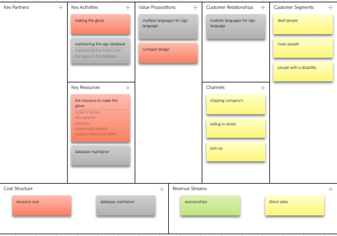

# Welcome to Dylan Vianen's Documentation

## Build HTML5 Chat app

So the idea is to make a chat app that communicates with other users via MQTT

#### Introduction to HTML5

HTML (HyperText Markup Language) is the code that is used to structure a web page and its content.

#### Introduction to CSS

CSS stands for Cascading Style Sheets. CSS describes how HTML elements are to be displayed on screen, paper, or in other media. CSS saves a lot of work. It can control the layout of multiple web pages all at once. External stylesheets are stored in CSS files.

### Building the front-end

For the front-end we started with just a sketch on a piece of paper for how we want our chat app to look like.

(Insert my sketch photo)

Here’s mine

After that we started roughly coding where everything should be in the html file

#### Explanation of the code

Everything from the chat app is stored in a div with a id of chatapp and a class of nothing (with a display of none). The class will later be changed by the login button

```html
<div class="nothing" id="chatapp">
```

### Building the back-end of the chat app

#### Introduction to MQTT

MQTT is a publish/subscribe protocol that allows edge-of-network devices to publish to a broker. Clients connect to this broker, which then mediates communication between the two devices. Each device can subscribe, or register, to particular topics.

#### Introduction to javascript

JavaScript is a scripting language that enables you to create dynamically updating content, control multimedia, animate images, and pretty much everything else. (Okay, not everything, but it is amazing what you can achieve with a few lines of JavaScript code.)

#### The ping and pong concept

A ping is a signal that is send by every user and when other users receive the ping they send a pong with their username and clientId

#### Explaining the code

This lets the chat app only connect when a button is pressed and not on startup

```javascript
app = {
connection: function () {
```

sendMsg and sendmessage does the same thing

When they are called they get the username from the html page and publish the message that was typed by the user and then empty the input

If a message comes in it will be filtered for pings and pongs and if there is non of both it is displayed in the chatlog on the html page

```javascript
function sendMsg(ele) {
  if (event.key === 'Enter' && toggle == 0) {
    var USER = document.getElementById('login').value;
    var userName = USER;//document.getElementById("loginName").value; // || "anonymous user"
    if (ele.value == "whoami") {
      console.log(userName);
      client.publish(mqttTopic, "Your name is " + userName + ", silly");
    }
    else if (ele.value == "disconnect") {
      var t = document.getElementById("toggle");
      console.log("disconnected user " + USER + " from topic " + mqttTopic)
      t.value = "disconnected";
      toggle = 1;
      console.log("off")
      console.log("disconnected")
      client.subscribe("", { qos: 0 })
    }
    client.publish(mqttTopic, userName + " says: " + ele.value);
    //alert(ele.value);
    ele.value = ""; // reset the input after entering
    // sendPing();
  }
}
```

This handels all the pongs that the users send and extracts the username and the clientId

```javascript
app = {
    client.on('message', function (topic, message, packet) {
      if (toggle == 0) {
        msg = message.toString(); // library delivers  buffer so convert to strig first
        console.log("onMessageArrived: " + msg);
        // if it has JSON payload do NOT add to chat
        try {
          msgObj = JSON.parse(message.toString()); // t is JSON so handle it how u want
          // if message has Pin of Pong in it send it to the PingPongHandler
          if (Object.keys(msgObj)[0] == "ping") { sendPong(); };
          if (Object.keys(msgObj)[0] == "pong") { handlePong(msgObj.pong); }; // pong value is an object!!
          // other handlers for control messages below
        } catch {
          document.getElementById("chatlog").innerHTML += "<br>" + msg;
          sendPing();
        }
      }
    })

```

Here the userlist is updated if there if a new user that is not yet in the list

### The final moment

Did I or did I not waste my time?

That is the golden question.

anddd the answer is…………………………….

YESSS it does
here is the login page of the webapp

and here is the mainpage of the webapp


## Building a nodejs local server

The idea is to build a local nodejs server to host the chat app and store every incoming message in mongodb

#### Introduction to nodejs

Node.js is an open source server environment. Node.js is free. Node. js runs on various platforms (Windows, Linux, Unix, Mac OS X, etc.) Node.js uses JavaScript on the server.

#### Introduction to mongodb

MongoDB is a non-relational document database that provides support for JSON-like storage. The MongoDB database has a flexible data model that enables you to store unstructured data, and it provides full indexing support, and replication with rich and intuitive APIs.

#### Introduction to mongoose

Mongoose is an Object Data Modeling (ODM) library for MongoDB and Node. js. It manages relationships between data, provides schema validation, and is used to translate between objects in code and the representation of those objects in MongoDB.

### Explaining of the code

If a message comes in this will check if its a ping(a call out for all online users), a pong( the answer to a pong with the name of the person in it)

```javascript
try {
    msgObj = JSON.parse(message.toString());
 
    // t is JSON so handle it how u want
    // if message has Pin of Pong in it send it to the PingPongHandler
    if (Object.keys(msgObj)[0] == "ping") {
      sendPong("codettes2022", "Dylan's Server", "cb_12345678");
    };
    if (Object.keys(msgObj)[0] == "pong") {
      handlePong(msgObj.pong);
    }; // pong value is an object!!
```

The for loop checks if there is a : is the message that will help is separate the name of the user and the message from each other

```javascript
 for (var i = 0; i < lengt; i++) {
      if (incomming[i] == ":") {
        var com = i;
        var place_name = i - 5;
        var place_inmes = i + 2;
        var login = false;
        console.log(i);
      }
    }
```

The substr function removes a little peace out of a large string this helps us get only the username in the variable name and only the message in the variable name

```javascript
var name = incomming.substr(0,place_name);
var inmessage = incomming.substr(place_inmes,lengt);
```

If the message is a welcome message it will be stored under a login key and send to be saved in a collection for login messages

```javascript
if (inmessage == incomming) {
        var myobj = {  login: inmessage, time: Date() };
        var collection = "login";
      }
```

If the message is not a welcome message the username, message and the time it was send will be stored under there separate keys and send to be saved in a collection for user messages

```javascript
else{
  varmyobj= { name:name, message:inmessage, time:Date()};
  varcollection="messages";
    }
```

This hosts the chatapp so when someone goes to the link this will serve up the html page and everything it needs

```javascript
constpublicDirectoryPath=path.join(__dirname,'data')
app.use('/',express.static(publicDirectoryPath))
```

### The final moment

Did i or did i not waste my time?

That is the golden question.

anddd the answer is…………………………….

YESSS it does


Here the chatapp is hosted on the nodejs server


Here the nodejs server is saving the messages in mongoDB


Here the login message can be seen saved in mongoDB


Here the user messages can be seen saved in mongoDB


## 3D printing

#### Introduction to 3D printing

3D printing, also known as additive manufacturing, is a method of creating a three dimensional object layer-by-layer using a computer created design. 3D printing is an additive process whereby layers of material are built up to create a 3D part.

#### Introduction to 3d printing filaments

The most used filaments are PLA and ABS

PLA and ABS are both thermoplastics. PLA is stronger and stiffer than ABS, but poor heat-resistance properties means PLA is mostly a hobbyist material. ABS is weaker and less rigid, but also tougher and lighter, making it a better plastic for prototyping applications.

### Installing cura and setting up the printer

I opened the setup wizard and followed the steps


After all that i opened the app and setup the printer

First i went to settings and pressed add printer


And then i searched for the anycubic predator because we are using that


### Setting up the cura parameters

Most of the time you can pick one of these profiles


but because we are using pla we have to change some settings like

Support: the support has to be everywhere


Build plate: the build plate has to be on brim


Material: the printing temp has to be on 190C and the build plate temp has to be on 60C


### Creating a 3D model for printing with tinkercad

First i open tinkercad and just dragged a random object

And then i exported it as an stl file to use later in cura


### Making the Gcode

In cura i opened the stl file that i made in tinkercad


And then i sliced it and saved it as a Gcode


## Busines model canvas

#### introduction to Business Model Canvas

The Business Model Canvas is a strategic management template used for developing new business models and documenting existing ones. It offers a visual chart with elements describing a firm's or product's value propositio, infrastructure, customers, and finances, assisting businesses to align their activities by illustrating potential trade-offs.

A business model canvas is basicely a business plan(Plan for successful operation of a business or startup that identifies Sources of Revenue and Target Customer Base combined with details of Financing) oversite in one page.

a business model canvas is good for pitching,  its Customer Focused,  Easy for Presenting and many more

Canvas were initially proposed in 2005 by Alexander Osterwalder

### The parts of a business model canvas

a business model canvas can be split in 9 different parts

and these are

. Key partners

here you specify who you need as a partner to run you business. The less partners you have the better because then you have less people to pay

.  Key Activities

here you specify what processes or tasks need to be done to keep your business running

.  Key Resources

here you specify what resources you need for your key activities

.  Cost structure

here you specify all your costs to keep your business up and running(opperational expensis)

.  Value proppositions

here you specify what kind of services or problem solvers your business has to ofer to the customer

. Costomer relationships

here you specify what you have to over that can keep your costomers hooked to your business(what sets you out from the others)

.  Channels

here you specify how your business is going to bring there product or service to the costomers

. Customer Segments

here you specify your target audionce(the people who are mostly going to buy your product or service)

. Revenue Streams

here you specify all your income streams(all the ways that your business earns monney)

here is my [business canvas](https://next.canvanizer.com/canvas/rBCFJIdPN3Fyr)



### Pitch deck/Poster

the pitch deck is used for presenting or giving people a quice look into what your trying to do or doing

your pitch deck can have anything you want on it but it usualy has everything abput your project or business and it should attract people to your booth

here is my pitch deck

** instert when done **

### pitching

when your pitching your business you have to have a impact story about the pain your trying to solve at the beginning becuase that will draw the peoples attention and make them remember you business longer. use a lot of visualisations in your powerpoint

there is my [powerpoint](https://docs.google.com/presentation/d/12t8hK0dObHDi4-inl7LIgl4JUvSRfCgX/edit?usp=sharing&ouid=110256527228353879293&rtpof=true&sd=true)


# 2d and 3d designing

### Installing freecad

I went to [this](https://github.com/FreeCAD/FreeCAD/releases) site and scrolled down till i saw this  And then i pressed on the 2.0 windows 64 bit version and waited for the download to finish


After it was done i open the installer and went through the steps

## Making a basic 3d shape

After it was done installing i opened freecad and made a new file, after that i pressed on the section toggle and pressed on part design


After that i made a new sketch


Where i choose the xy_plane


And here i made a basic block


Then i choose constrain for horizontal and vertical


And i set them both to 100mm


And then you get this basic square


When you have a square you press on Pad(that will make it a 3d schape)


And i set the dimension to 10mm


And when you do that you get this 3d shape


### Making a pocket in the basic 3d shape

I made a new schape in the XY_Plain


And pressed on create circle


And added s circle on the 3d shape


After that i pressed on pocket


And checked symmetric to plane or reversed


And the you schoul have a pocket!!


